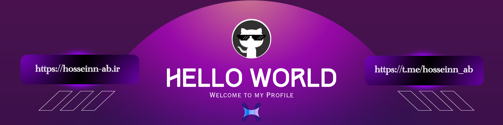

<!--Banner-->


<!--Night Owl image-->
<div>
  
</div>

<!--Header Name-->
#  𝓲'𝓶 𝓗𝓸𝓢𝓲 ! 
*Digital Craftsman (Developer / Programmer)*
<br /> 

###  A little more about me...  

```javascript
const HosseinAbbasi = {
  pronouns: "he" | "man",
  code: [Wordpress, HTML, CSS, , Python],
  tools: [Wordpress(WP)],
 challenge: "I am doing the #100DaysOfCode challenge focused on projrct and website design"
}
```

<!--Start Intro-->               
<p align="left">I am a Full HTML , CSS , wordpress (WP)</p>

- ✨ Student of life :)
- 🌱 I’m currently learning many things, I believe that everyday is a learning opportunity.
- 💁‍♂️ Trusted member and Moderator at [Gurden Community](https://gurdenvpn.loveslife.biz)
- ❤ Contributing to Open Source.
- 💻 Visit my [Portfolio](https://hosseinn-ab.ir) for more details about me.
<!--End Intro-->

<!--Profile Count Badge-->
<p align="left">
  
</p>

---

<!--Trophies Section-->   
<h2 align="center">🏆 Gɪᴛʜᴜʙ Tʀᴏᴘʜɪᴇs 🏆</h2>
<p align="center">
  <a href="https://github.com/hosseinn-ab1">
    <picture>
      <source media="(prefers-color-scheme: dark)" srcset="https://github-profile-trophy.vercel.app/?username=Kiran1689&no-bg=true&row=2&column=6&margin-w=20&margin-h=20&theme=monokai">
      <source media="(prefers-color-scheme: light)" srcset="https://github-profile-trophy.vercel.app/?username=Kiran1689&no-bg=true&row=2&column=6&margin-w=20&margin-h=20">
      
    </picture>
  </a>
</p>
<br />

<!--Github stats Table--> 
<h2 align="center">📊 Gɪᴛʜᴜʙ Sᴛᴀᴛs 📊</h2>

<table width="100%">
  <tr>
    <td width="50%">
      <h3 align="center"><strong>Gɪᴛʜᴜʙ Sᴛᴀᴛs</strong></h3>
      <p align="center">
        <a href="https://github.com/hosseinn-ab1">
          
        </a>
      </p>
    </td>
    <td width="100%">
      <h3 align="center"><strong>Sᴛʀᴇᴀᴋ Sᴛᴀᴛs</strong></h3>
      <p align="center">
        <a href="https://github.com/hosseinn-ab1">
          
        </a>
      </p>
    </td>
  </tr>
  <tr>
    <td width="50%">
      <h3 align="center"><strong>Lᴀᴛᴇsᴛ Pʀᴏᴊᴇᴄᴛ</strong></h3>
      <p align="center">
        <a href="https://github.com/hosseinn-ab1">
          
        </a>
      </p>
    </td>
    <td width="50%">
      <h3 align="center"><strong>Tᴏᴘ Cᴏɴᴛʀɪʙᴜᴛɪᴏɴs</strong></h3>
      <p align="center">
        <a href="https://github.com/hosseinn-ab1">
          
        </a>
      </p>
    </td>
  </tr>
</table>
<br />

<!--Contribution Graph-->
<h2 align="center">📈 Cᴏɴᴛʀɪʙᴜᴛɪᴏɴ Gʀᴀᴘʜ 📈</h2>
<div align="center">
    
</div>

---

<!--Dynamic Quote card updates everyday at 12 PM--> 
<h2 align="center">🌟 Tʜᴏᴜɢʜᴛ ᴏғ ᴛʜᴇ Dᴀʏ 🌟</h2>


<!--STARTS_HERE_QUOTE_CARD-->
<p align="center">
    
</p>
<!--ENDS_HERE_QUOTE_CARD-->


<!--Contact Section--> 

<h2 align="center">🤝 Cᴏɴɴᴇᴄᴛ Wɪᴛʜ Mᴇ 🤝 </h2>
<div align="center">
  
<a href="mailto:basy16b84@gmail.com" target="_blank">

</a>

<a href="https://x.com/hosseinn_ab" target="_blank">

</a>

<a href="https://www.instagram.com/hosseinn_ab" target="_blank">

</a>

<a href="https://www.githubcom/hosseinn-ab1" target="_blank">

</a>

<a href="https://www.linkedin.com/in/hosseinn_ab/" target="_blank">

</a>
</div>
<br/>

<!--Buy me a coffee-->
<div align="center">
<a href="https://t.me/hosseinn_ab" target="_blank"></a>
</div>


<!--Footer--> 
<p align="center">
  
</p>

